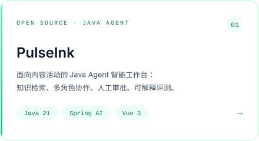
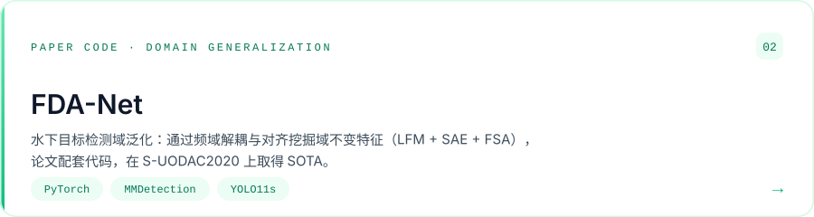

<picture>
  <source media="(prefers-color-scheme: dark)" srcset="./assets/hero-dark.svg" />
  <source media="(prefers-color-scheme: light)" srcset="./assets/hero-light.svg" />
  
</picture>

  
  
  
  
  
  

  <strong>现在在做：</strong><a href="https://github.com/j11andme/pulseink">PulseInk</a>（Java Agent 工作台）、<a href="https://github.com/j11andme/FDA-Net">FDA-Net</a>（小论文配套代码）。

  <a href="https://github.com/j11andme?tab=repositories">Repositories</a>
  ·
  <a href="mailto:3244315894@qq.com">Email</a>

### 精选项目 Selected Work

<a href="https://github.com/j11andme/pulseink"><picture><source media="(prefers-color-scheme: dark)" srcset="./assets/project-pulseink-dark.svg" /><source media="(prefers-color-scheme: light)" srcset="./assets/project-pulseink-light.svg" /></picture></a> <a href="https://github.com/j11andme/FDA-Net"><picture><source media="(prefers-color-scheme: dark)" srcset="./assets/project-fdanet-dark.svg" /><source media="(prefers-color-scheme: light)" srcset="./assets/project-fdanet-light.svg" /></picture></a>
 
 
 &nbsp; 

### 贡献信号 Activity

<picture>
  <source media="(prefers-color-scheme: dark)" srcset="https://raw.githubusercontent.com/j11andme/j11andme/output/github-contribution-grid-snake-dark.svg" />
  <source media="(prefers-color-scheme: light)" srcset="https://raw.githubusercontent.com/j11andme/j11andme/output/github-contribution-grid-snake.svg" />
  
</picture>

 
 

<a href="mailto:3244315894@qq.com">聊聊 →</a>

